# WEB-LAB-8
<p align = "center">МИНИСТЕРСТВО НАУКИ И ВЫСШЕГО ОБРАЗОВАНИЯ<br>
РОССИЙСКОЙ ФЕДЕРАЦИИ<br>
ФЕДЕРАЛЬНОЕ ГОСУДАРСТВЕННОЕ БЮДЖЕТНОЕ<br>
ОБРАЗОВАТЕЛЬНОЕ УЧРЕЖДЕНИЕ ВЫСШЕГО ОБРАЗОВАНИЯ<br>
«САХАЛИНСКИЙ ГОСУДАРСТВЕННЫЙ УНИВЕРСИТЕТ»</p>
<br><br><br><br><br><br>
<p align = "center">Институт естественных наук и техносферной безопасности<br>Кафедра информатики<br>Шинкаренко Кирилл Константинович</p>
<br><br><br>
<p align = "center"><br><strong>Лабораторная работа №8.«JS»</strong><br>01.03.02 Прикладная математика и информатика</p>
<br><br><br><br><br><br><br><br><br><br><br><br>
<p align = "right">Научный руководитель<br>
Соболев Евгений Игоревич</p>
<br><br><br>
<p align = "center">г. Южно-Сахалинск<br>2024 г.</p>
<br><br><br><br><br><br><br><br><br><br><br><br>

<h1 align = "center">Введение</h1>

<p><b>HTML</b> —  стандартизированный язык гипертекстовой разметки документов для просмотра веб-страниц в браузере. Веб-браузеры получают HTML документ от сервера по протоколам HTTP/HTTPS или открывают с локального диска, далее интерпретируют код в интерфейс, который будет отображаться на экране монитора.</p>
<p><b>CSS</b> — формальный язык описания внешнего вида документа, написанного с использованием языка разметки. Также может применяться к любым XML-документам, например, к SVG или XUL.</p>


<h1 style="text-align: center">Задачи js</h1>
<ol> 
    <li>Напишите оператор if, такой, чтобы в качестве выражения в скобках у него были значения true, false (Например, if( true ) или if( false )). Посмотрите как работает этот оператор, поместив какую-нибудь команду после круглых скобок (Например, console.log(1)).</li> <li>Создайте переменные m и n. В m поместите произвольное числовое значение. Напишите оператор ветвления if так, чтобы если m было больше 50, то в переменную n помещалось слово «большое», иначе — слово «маленькое».</li> <li>Определите сколько раз выполнится цикл while? Примечание: это можно сделать прочитав скрипт или запустив его консоли браузера. <pre><code>var i = 2; while( i < 9 ){ console.log( i++ ); } </code></pre></li> <li>Напишите скрипт, который используя оператор while выведет все числа от 45 до 67.</li> <li>Напишите скрипт, который используя оператор while выведет все числа от 45 до 670, кратные 10.</li> <li>Напишите скрипт, который используя оператор for выполнит два предыдущих задания.</li> <li>Переменная n хранит целое число от 0 до 9. Используя оператор switch, написать скрипт, который в зависимости от числа будет выводить слово (Например, если n равно 3, то будет выводиться слово «три») <pre><code>var n = 5; switch( n ){ //Напишите тут свой код } </code></pre></li> <li>Используя <code>document.write()</code> и любую из циклических конструкций выведите десять одинаковых изображений (надо выводить <code>&lt;img src="..." alt="..." /&gt;</code>)</li> <li>В переменных size и unit хранятся размер и единицы измерения информации 120 и «Кб» соответственно. Зная что могут быть заданные Кб, Мб, Гб (кило-, мега- и гигабайты) и 1килобайт равен 1024 байта, найти количество байт в size.</li> <li>Постройте при помощи циклов JavaScript скрипт для календаря на HTML. Примечание: выполнить задание для одного месяца, используя HTML-элемент <code>table</code></li> <li>Напишите функцию <code>hello1()</code>, которая при вызове будет возвращать строку «Привет, JavaScript!».</li> <li>Напишите функцию <code>hello2()</code>, которая при вызове будет принимать переменную <code>name</code> (например, «Василий») и выводить строку (в нашем случае «Привет, Василий»). В случае отсутствующего аргумента выводить «Привет, гость»</li> <li>Напишите функцию <code>mul(n,m)</code>, которая принимает два аргумента и возвращает произведение этих аргументов. Проверьте ее работу.</li> <li>Создайте функцию <code>repeat(str, n)</code>, которая возвращает строку, состоящую и n повторений строки <code>str</code>. <code>n</code> — по умолчанию 2, <code>str</code> — пустая строка</li> <li>Создайте функцию <code>rgb()</code>, которая будет принимать три числовых аргумента и возвращать строку вида «rgb(23,100,134)». Если аргументы не заданы, считать их равными нулю. Не проверять переменные на тип данных</li> <li>Создайте функцию <code>avg()</code>, которая будет находить среднее значение по всем своим аргументам (аргументы величины числовые).</li> <li>Создайте функцию <code>m(a,b)</code> оболочку для <code>mul()</code>. <code>m()</code> должна принимать два аргумента а возвращать результат работы <code>mul()</code> с этими двумя аргументами После выполнения задания поэкспериментируйте, создайте функцию <code>log()</code>, которая будет принимать одно значение, а вызывать <code>console.log()</code> с этим значением.</li> <li>Напишите функцию <code>operation(m,n,o)</code>, в которой <code>m</code> и <code>n</code> — числовые переменные, а <code>o</code> — функциональный литерал, который берет два аргумента и выполняет математическую операцию над ними</li> <li>Напишите функцию <code>addN(n)</code>, которая вернёт другую функцию. Возвращенная функция должна складывать получаемый аргумент с аргументом <code>n</code> возвращающей функции.</li> <li>Напишите функцию <code>words()</code>, которая в зависимости от переданного в нее целочисленного аргумента <code>n</code>, будет выводить слово «товар» в нужно форме («12 товаров», но «22 товара»). По умолчанию аргумент <code>d</code> должен иметь значение 0</li> 
    <li>Решить задачу на сайте https://www.codewars.com/kata/596fd97f65ad2fc072000037</li>
    <li>Решить задачу на сайте https://www.codewars.com/kata/5925138effaed0de490000cf</li>
    <li>Решить задачу на сайте https://www.codewars.com/kata/59269e371a640c0e98000085</li>
    <li>Решить задачу на сайте https://www.codewars.com/kata/5913ffb2cb1475215c000039</li>
</ol>


<h1 style="text-align: center">Решения CSS</h1>

<h2 style="text-align: center">Файлы 1 - 20.html</h2>

1
```html
<!DOCTYPE html>
<html lang="en">
<head>
    <meta charset="UTF-8">
    <meta name="viewport" content="width=device-width, initial-scale=1.0">
    <title>Document</title>
</head>
<body>
    <script>
        if (true) { 
            console.log("true");
        } else if (false) {
            console.log("false");
        }
    </script>
</body>
</html>
```

2
```html
<!DOCTYPE html>
<html lang="en">
<head>
    <meta charset="UTF-8">
    <meta name="viewport" content="width=device-width, initial-scale=1.0">
    <title>Document</title>
</head>
<body>
    <script>
        let m = 333;
        let n = '';

        if (m > 50) {
            n = 'Большое';
        } else {
            n = 'Маленькое';
        }
    </script>
</body>
</html>
```

3
```html
<!DOCTYPE html>
<html lang="en">
<head>
    <meta charset="UTF-8">
    <meta name="viewport" content="width=device-width, initial-scale=1.0">
    <title>Document</title>
</head>
<body>
    <script>
        var i = 2;
        while( i < 9 ){
            console.log( i++ );
        }

        // Выполнится 7 раз.
    </script>
</body>
</html>
```

4
```html
<!DOCTYPE html>
<html lang="en">
<head>
    <meta charset="UTF-8">
    <meta name="viewport" content="width=device-width, initial-scale=1.0">
    <title>Document</title>
</head>
<body>
    <script>
        let n = 45;
        while (n < 68) {
            console.log(n++);
        }
    </script>
</body>
</html>
```

5
```html
<!DOCTYPE html>
<html lang="en">
<head>
    <meta charset="UTF-8">
    <meta name="viewport" content="width=device-width, initial-scale=1.0">
    <title>Document</title>
</head>
<body>
    <script>
        let n = 45;
        while (n++ < 671) {
            if (n % 10 == 0) {
                console.log(n);
            }
        }
    </script>
</body>
</html>
```

6
```html
<!DOCTYPE html>
<html lang="en">
<head>
    <meta charset="UTF-8">
    <meta name="viewport" content="width=device-width, initial-scale=1.0">
    <title>Document</title>
</head>
<body>
    <script>
        for(let i = 45; i < 671; i++) {
            if (i < 68) {
                console.log(i);
            }else if (i % 10 == 0) {
                console.log(i);
            }
        }
    </script>
</body>
</html>
```

7
```html
<!DOCTYPE html>
<html lang="en">
<head>
    <meta charset="UTF-8">
    <meta name="viewport" content="width=device-width, initial-scale=1.0">
    <title>Document</title>
</head>
<body>
    <script>
        let n = 9;

        switch (n) {
            case 0 : {
                console.log("Ноль");
                break;
            }
            case 1 : {
                console.log("Один");
                break;
            }
            case 2 : {
                console.log("Два");
                break;
            }
            case 3 : {
                console.log("Три");
                break;
            }
            case 4 : {
                console.log("Четыре");
                break;
            }
            case 5 : {
                console.log("Пять");
                break;
            }
            case 6 : {
                console.log("Шесть");
                break;
            }
            case 7 : {
                console.log("Семь");
                break;
            }
            case 8 : {
                console.log("Восемь");
                break;
            }
            case 9 : {
                console.log("Девять");
                break;
            }
            default : {
                console.log('Неверное число!')
            }
        }
    </script>
</body>
</html>
```

8
```html
<!DOCTYPE html>
<html lang="en">
<head>
    <meta charset="UTF-8">
    <meta name="viewport" content="width=device-width, initial-scale=1.0">
    <title>Document</title>
</head>
<body>
    <script>
        for (let i = 0; i < 10; i++) {
            document.write("");
        }
    </script>
</body>
</html>
```

9
```html
<!DOCTYPE html>
<html lang="en">
<head>
    <meta charset="UTF-8">
    <meta name="viewport" content="width=device-width, initial-scale=1.0">
    <title>Document</title>
</head>
<body>
    <script>
        let size = 1;

        let bytesInKiloBytes = 1024,
            kiloBytesInMegaBytes = 1024,
            megaBytesInGigaBytes = 1024;

        let unit = "Mb".toLowerCase();
        let bytesInSize;

        switch (unit) {
            case "kb": {
                bytesInSize = size * bytesInKiloBytes;
                break;
            }

            case "mb": {
                bytesInSize = size * bytesInKiloBytes * kiloBytesInMegaBytes;
                break;
            }

            case "gb": {
                bytesInSize = size * bytesInKiloBytes * kiloBytesInMegaBytes * megaBytesInGigaBytes;
                break;
            }

            default : {
                bytesInSize = null;
            }
        }

        console.log(bytesInSize == null ? "Неудачно!" : bytesInSize);

    </script>
</body>
</html>
```

10
```html
<!DOCTYPE html>
<html lang="en">
<head>
    <meta charset="UTF-8">
    <meta name="viewport" content="width=device-width, initial-scale=1.0">
    <title>Document</title>
</head>
<body>
    <h1>Январь</h1>
    <table id="myTable">
        <tr>
            <th>ПН</th><th>ВТ</th><th>СР</th><th>ЧТ</th><th>ПТ</th><th>СБ</th><th>ВС</th>
        </tr>
    </table>
    


    <script>
        let table = document.getElementById('myTable');
        let daysInMonth = 31;
        let days = 1;

        for(let i = 1; i < 6; i++) {
            table.innerHTML += "<tr></tr>";
            let rows = document.getElementsByTagName("tr");
            for(let j = 0; j < 7 & days <= daysInMonth; j++) {
                rows.item(i).innerHTML += "<td>" + days++ + "</td>";
            } 
        }
    </script>
</body>
</html>
```

11
```html
<!DOCTYPE html>
<html lang="en">
<head>
    <meta charset="UTF-8">
    <meta name="viewport" content="width=device-width, initial-scale=1.0">
    <title>Document</title>
</head>
<body>
    <script>
        function hello1() {
            return "Hello, JavaScript!";
        }
        console.log(hello1());
    </script>
</body>
</html>
```

12
```html
<!DOCTYPE html>
<html lang="en">
<head>
    <meta charset="UTF-8">
    <meta name="viewport" content="width=device-width, initial-scale=1.0">
    <title>Document</title>
</head>
<body>
    <script>
        function hello2(name) {
            return name != null? `Привет, ${name}!` : "Привет, гость!";
        }

        console.log(hello2("Вася"));
    </script>
</body>
</html>
```

13
```html
<!DOCTYPE html>
<html lang="en">
<head>
    <meta charset="UTF-8">
    <meta name="viewport" content="width=device-width, initial-scale=1.0">
    <title>Document</title>
</head>
<body>
    <script>
        function mul(x, y) {
            return x*y;
        }

        console.log(mul(5, 5));
    </script>
</body>
</html>
```

14
```html
<!DOCTYPE html>
<html lang="en">
<head>
    <meta charset="UTF-8">
    <meta name="viewport" content="width=device-width, initial-scale=1.0">
    <title>Document</title>
</head>
<body>
    <script>
        function repeat(str = '', n = 2) {
            return str.repeat(n);
        }

        console.log(repeat("abc", 5));
    </script>
</body>
</html>
```

15
```html
<!DOCTYPE html>
<html lang="en">
<head>
    <meta charset="UTF-8">
    <meta name="viewport" content="width=device-width, initial-scale=1.0">
    <title>Document</title>
</head>
<body>
    <script>
        function rgb(r = 0, g = 0, b = 0) {
            return `rgb(${r}, ${g}, ${b})`;
        }

        console.log(rgb());
    </script>
</body>
</html>
```

16
```html
<!DOCTYPE html>
<html lang="en">
<head>
    <meta charset="UTF-8">
    <meta name="viewport" content="width=device-width, initial-scale=1.0">
    <title>Document</title>
</head>
<body>
    <script>
        function avg() {

            let array = argsToArray(arguments);

            if (array.some((el) => isNaN(el))) {
                return 0;
            }

            let result = 0;
            for (let i = 0; i < arguments.length; i++) {
                result += arguments[i];
            }

            return result / arguments.length;
        }

        function argsToArray(arguments) {
            let args = [];
            for (let i = 0; i < arguments.length; i++){
                args[i] = arguments[i];
            }

            return args;
        }

        console.log(avg('1'));
    </script>
</body>
</html>
```

17
```html
<!DOCTYPE html>
<html lang="en">
<head>
    <meta charset="UTF-8">
    <meta name="viewport" content="width=device-width, initial-scale=1.0">
    <title>Document</title>
</head>
<body>
    <script>
        function m(x, y) {
            return mul(x, y);
        }

        function mul(x, y) {
            return x*y;
        }

        function log(str) {
            return console.log(str);
        }

        log(m(5,5));
    </script>
</body>
</html>
```

18
```html
<!DOCTYPE html>
<html lang="en">
<head>
    <meta charset="UTF-8">
    <meta name="viewport" content="width=device-width, initial-scale=1.0">
    <title>Document</title>
</head>
<body>
    <script>
        function operation(x, y, operation) {
            return operation(x, y);
        }

        console.log(operation(1, 5, (x, y) => (x+y)));
    </script>
</body>
</html>
```

19
```html
<!DOCTYPE html>
<html lang="en">
<head>
    <meta charset="UTF-8">
    <meta name="viewport" content="width=device-width, initial-scale=1.0">
    <title>Document</title>
</head>
<body>
    <script>
        function addN(n) {
            let func = (x) => (x**2 + x);
            return func(n);
        }

        console.log(addN(5));
    </script>
</body>
</html>
```

20
```html
<!DOCTYPE html>
<html lang="en">
<head>
    <meta charset="UTF-8">
    <meta name="viewport" content="width=device-width, initial-scale=1.0">
    <title>Document</title>
</head>
<body>
    <script>
        function words(n = 0) {

            let str = n.toString();
            let importantPart = chooseImportantPart(str);
            
            switch (importantPart) {
                case "1":{
                    return `${n} товар`;
                    break;
                }
                case "2":
                case "3":
                case "4":{
                    return `${n} товара`;
                    break;
                }
                default : {
                    return `${n} товаров`;
                    break;
                }
                     
            }
        }

        function chooseImportantPart(str) {
            if (str.length < 2) {
                return str;
            } else if (str.length >= 2){
                if (str.match(/\d1\d$/)) {
                    return str;
                } else {
                    return str[str.length-1];
                }
            }
            

        }

        console.log(words(121));
    </script>
</body>
</html>
```

<h1 align = "center">Результат HTML</h1>

<ol>
  <li>
    <div style="display: flex; flex-direction: column">
        <div>Напишите оператор if, такой, чтобы в качестве выражения в скобках у него были значения true, false (Например, if( true ) или if( false )). Посмотрите как работает этот оператор, поместив какую-нибудь команду после круглых скобок (Например, console.log(1)).</div>
        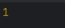
    </div>
  </li>
  <li>
    <div style="display: flex; flex-direction: column">
        <div>Создайте переменные m и n. В m поместите произвольное числовое значение. Напишите оператор ветвления if так, чтобы если m было больше 50, то в переменную n помещалось слово «большое», иначе — слово «маленькое».</div>
        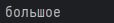
    </div>
  </li>
  <li>
    <div style="display: flex; flex-direction: column">
        <div>Определите сколько раз выполнится цикл while? Примечание: это можно сделать прочитав скрипт или запустив его консоли браузера. <pre><code>var i = 2; while( i < 9 ){ console.log( i++ ); } </code></pre></div>
        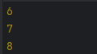
    </div>
  </li>
  <li>
    <div style="display: flex; flex-direction: column">
        <div>Напишите скрипт, который используя оператор while выведет все числа от 45 до 67.</div>
        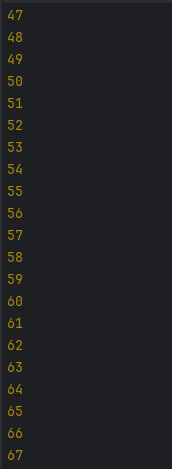
    </div>
  </li>
  <li>
    <div style="display: flex; flex-direction: column">
        <div>Напишите скрипт, который используя оператор while выведет все числа от 45 до 670, кратные 10.</div>
        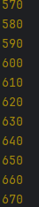
    </div>
  </li>
  <li>
    <div style="display: flex; flex-direction: column">
        <div>Напишите скрипт, который используя оператор for выполнит два предыдущих задания.</div>
        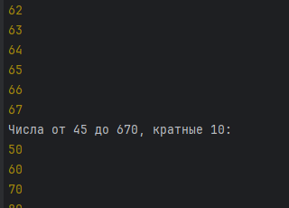
    </div>
  </li>
  <li>
    <div style="display: flex; flex-direction: column">
        <div>Переменная n хранит целое число от 0 до 9. Используя оператор switch, написать скрипт, который в зависимости от числа будет выводить слово (Например, если n равно 3, то будет выводиться слово «три») <pre><code>var n = 5; switch( n ){ //Напишите тут свой код } </code></pre></div>
        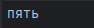
    </div>
  </li>
  <li>
    <div style="display: flex; flex-direction: column">
        <div> Используя <code>document.write()</code> и любую из циклических конструкций выведите десять одинаковых изображений (надо выводить <code>&lt;img src="..." alt="..." /&gt;</code>)</div>
        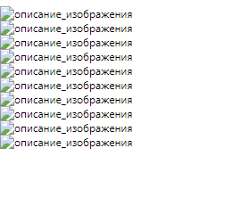
    </div>
  </li>
  <li>
    <div style="display: flex; flex-direction: column">
        <div>В переменных size и unit хранятся размер и единицы измерения информации 120 и «Кб» соответственно. Зная что могут быть заданные Кб, Мб, Гб (кило-, мега- и гигабайты) и 1килобайт равен 1024 байта, найти количество байт в size.</div>
        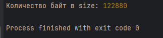
    </div>
  </li>
  <li>
    <div style="display: flex; flex-direction: column">
        <div>Постройте при помощи циклов JavaScript скрипт для календаря на HTML. Примечание: выполнить задание для одного месяца, используя HTML-элемент <code>table</code></div>
        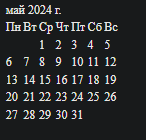
    </div>
  </li>
  <li>
    <div style="display: flex; flex-direction: column">
        <div>Напишите функцию <code>hello1()</code>, которая при вызове будет возвращать строку «Привет, JavaScript!».</div>
        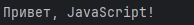
    </div>
  </li>
  <li>
    <div style="display: flex; flex-direction: column">
        <div>Напишите функцию <code>hello2()</code>, которая при вызове будет принимать переменную <code>name</code> (например, «Василий») и выводить строку (в нашем случае «Привет, Василий»). В случае отсутствующего аргумента выводить «Привет, гость»</div>
        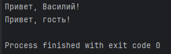
    </div>
  </li>
  <li>
    <div style="display: flex; flex-direction: column">
        <div>Напишите функцию <code>mul(n,m)</code>, которая принимает два аргумента и возвращает произведение этих аргументов. Проверьте ее работу.</div>
        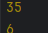
    </div>
  </li>
  <li>
    <div style="display: flex; flex-direction: column">
        <div>Создайте функцию <code>repeat(str, n)</code>, которая возвращает строку, состоящую и n повторений строки <code>str</code>. <code>n</code> — по умолчанию 2, <code>str</code> — пустая строка</div>
        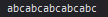
    </div>
  </li>
  <li>
    <div style="display: flex; flex-direction: column">
        <div>Создайте функцию <code>rgb()</code>, которая будет принимать три числовых аргумента и возвращать строку вида «rgb(23,100,134)». Если аргументы не заданы, считать их равными нулю. Не проверять переменные на тип данных</div>
        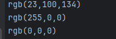
    </div>
  </li>
  <li>
    <div style="display: flex; flex-direction: column">
        <div>Создайте функцию <code>avg()</code>, которая будет находить среднее значение по всем своим аргументам (аргументы величины числовые).</div>
        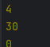
    </div>
  </li>
  <li>
    <div style="display: flex; flex-direction: column">
        <div>Создайте функцию <code>m(a,b)</code> оболочку для <code>mul()</code>. <code>m()</code> должна принимать два аргумента а возвращать результат работы <code>mul()</code> с этими двумя аргументами После выполнения задания поэкспериментируйте, создайте функцию <code>log()</code>, которая будет принимать одно значение, а вызывать <code>console.log()</code> с этим значением.</div>
        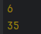
    </div>
  </li>
  <li>
    <div style="display: flex; flex-direction: column">
        <div>Напишите функцию <code>operation(m,n,o)</code>, в которой <code>m</code> и <code>n</code> — числовые переменные, а <code>o</code> — функциональный литерал, который берет два аргумента и выполняет математическую операцию над ними</div>
        
    </div>
  </li>
  <li>
    <div style="display: flex; flex-direction: column">
        <div>Напишите функцию <code>addN(n)</code>, которая вернёт другую функцию. Возвращенная функция должна складывать получаемый аргумент с аргументом <code>n</code> возвращающей функции.</div>
        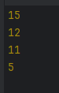
    </div>
  </li>
  <li>
    <div style="display: flex; flex-direction: column">
        <div>Напишите функцию <code>words()</code>, которая в зависимости от переданного в нее целочисленного аргумента <code>n</code>, будет выводить слово «товар» в нужно форме («12 товаров», но «22 товара»). По умолчанию аргумент <code>d</code> должен иметь значение 0</div>
        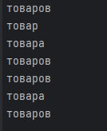
    </div>
  </li>
  <li>
    <div style="display: flex; flex-direction: column">
        <div>Решить задачу на сайте https://www.codewars.com/kata/596fd97f65ad2fc072000037</div>
        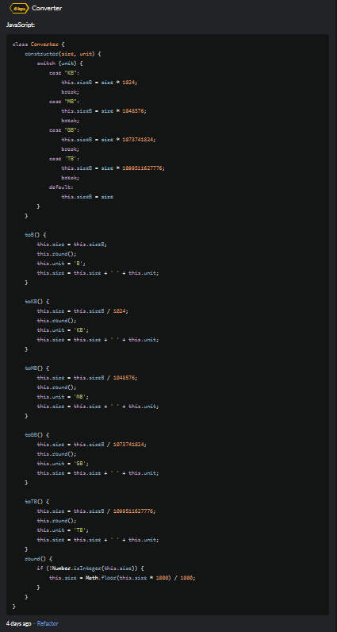
    </div>
  </li>
  <li>
    <div style="display: flex; flex-direction: column">
        <div> Решить задачу на сайте https://www.codewars.com/kata/5925138effaed0de490000cf</div>
        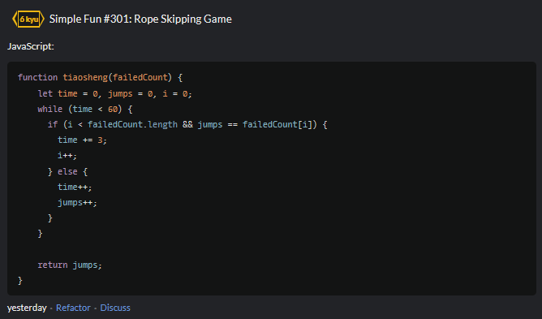
    </div>
  </li>
  <li>
    <div style="display: flex; flex-direction: column">
        <div>Решить задачу на сайте https://www.codewars.com/kata/59269e371a640c0e98000085</div>
        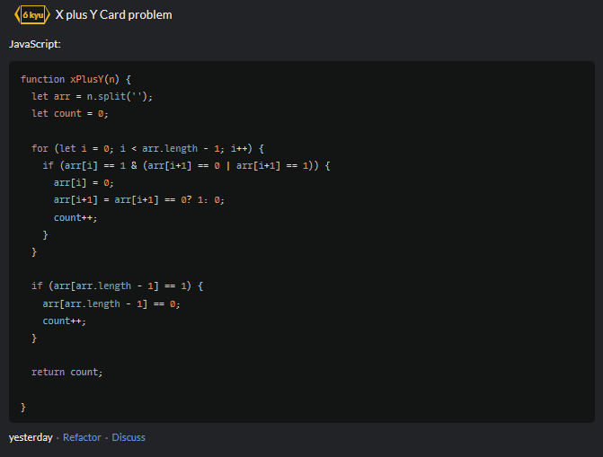
    </div>
  </li>
  <li>
    <div style="display: flex; flex-direction: column">
        <div>Решить задачу на сайте https://www.codewars.com/kata/5913ffb2cb1475215c000039</div>
        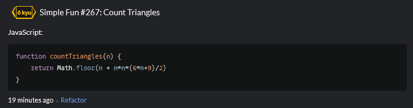
    </div>
  </li>
</ol>

<h1 align = "center">Вывод</h1>
<p>В ходе выполнения лабораторной работы по js я научился оперировать строками, массивами, затронул работу с классами, попрактиковался на задачах с CodeWars.</p>
